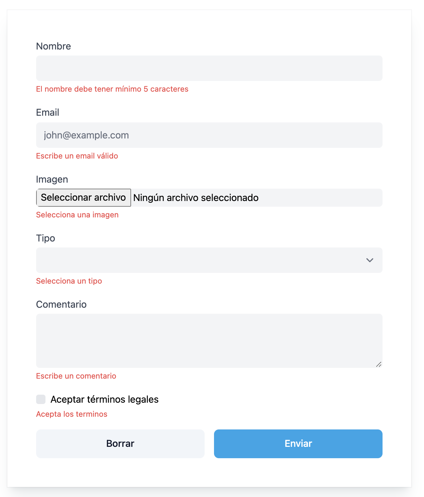
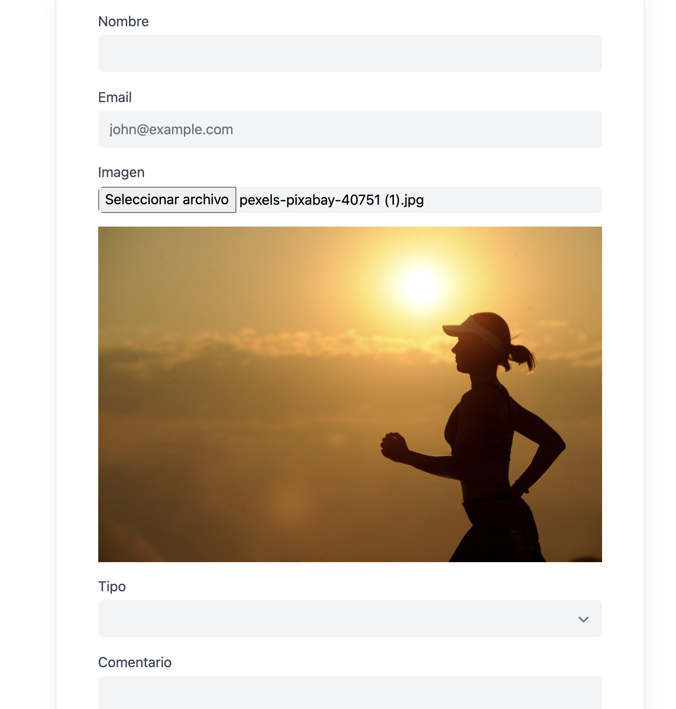
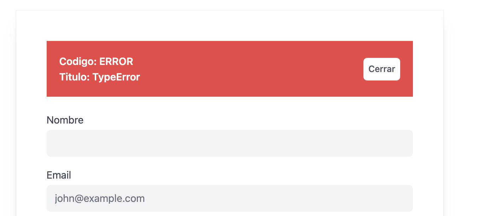
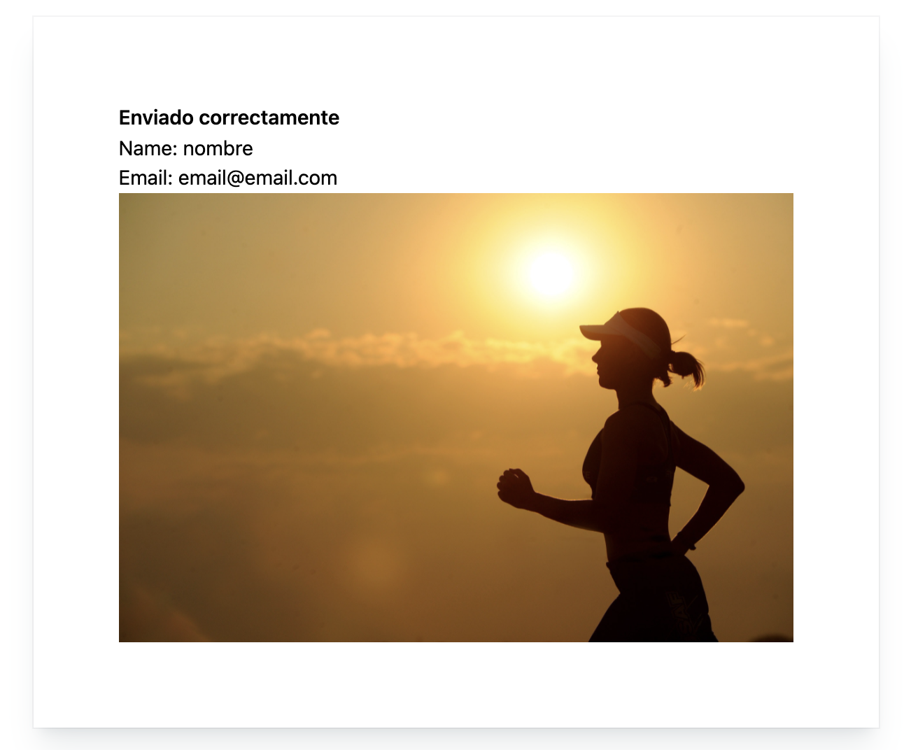

# JS

Dado el formulario siguiente crear las funcionalidades requeridas.
Se valorará el hecho de usar vue, pero se puede usar librerias o frameworks que quieras.

## Validación de inputs

Cada input debe validarse una vez se clica fuera de él y antes de enviar el formulario.
En caso de error saldrá un mensaje debajo de cada input con información.

Validaciones:
- nombre: mínimo 5 carácteres
- email: email válido
- imagen: solo debe aceptar jpg de max 2MB y debe tener 1 imagen seleccionada
- checklegales: debe estar seleccionado



## Imagen

Una vez se selecciona una imagen esta debe previsualizarse debajo del input.



## Aviso

Ocultar el aviso y solo mostrarlo en caso de error al enviar el formulario.



## Botones

### Borrar

Al clicar el boton borrar deben resetearse todos los datos del formulario.

### Enviar

Al clickar en el boton enviar se comprueban todos los inputs y si todo es correcto se hace un submit del formulario al siguiente endpoint pasando los parametros como json:

```curl 
https://api.test.kuvut.com/test/submit
```

#### params:
- name: string
- email: string
- image: base64 image
- legals: bool

### Sample request

```bash 
curl --location --request POST 'https://api.test.kuvut.com/test/submit' \
--data-raw '{"name":"nombre","email":"email@email.com","image":"data:image/jpeg;base64,/9j/4AAQSkZJRgABAQEASABIAAD/2wBDAP//////////////////////////////////////////////////////////////////////////////////////2wBDAf//////////////////////////////////////////////////////////////////////////////////////wAARCADqATkDASIAAhEBAxEB/8QAFwABAQEBAAAAAAAAAAAAAAAAAAECA//EACQQAQEBAAIBBAMBAQEBAAAAAAABESExQQISUXFhgZGxocHw/8QAFQEBAQAAAAAAAAAAAAAAAAAAAAH/xAAWEQEBAQAAAAAAAAAAAAAAAAAAEQH/2gAMAwEAAhEDEQA/AMriLyCKgg1gQwCgs4FTMOdutepjQak+FzMSVqgxZdRdPPIIvH5WzzGdBriphtTeAXg2ZjKA1pqKDUGZca3foBek8gFv8Ie3fKdA1qb8s7hoL6eLVt51FsAnql3Ut1M7AWbflLMDkEMX/F6/YjK/pADFQAUNA6alYagKk72m/j9p4Bq2fDDSYKLNXPNLoHE/NT6RYC31cJxZ3yWVM+aBYi/S2ZgiAsnYJx5D21vPmqrm3PTfpQQwyAC8JZvSKDni41ZrMuUVVl+Uz9w9v/1QWrZsZ5nFPHYH+JZyureQSF5M+fJ0CAfwRAVRBQA1DAWVUayoJUWoDpsxntPsueBV4+VxhdyAtv8AjOLGpIDMLbeGvbF4iozJfr/WukAVABAXAQXEAAASzVAZdO2WNordm+emFl7XcQSNZiFtv0C9w90nhJf4mA1u+GcJFwIyAqL/AOovwgGNfSRqdIrNa29M0gKCAojU9PAMjWXpckEJFNFEAAXEUBABYz6rZ0ureQc9vyt9XxDF2QAXtABcQAs0AZywkvluJbyipifas52DcyxjlZweAO0xri/hc+wZOEKIu6nSyeToVZyWXwvCg53gW81QQ7aTNAn5dGZJPs1UXURQAUEMCXQLZE93PRZ5hPTgNMrbIzKCm52LZwCs+2M8w2g3sjPuZAXb4IsMAUACzVUGM4/K+md6vEXUUyM5PDR0IxYe6ramih0VNBrS4xoqN8Q1BFQk3yqyAsioioAAKgDSJL4/jQIn5igLrPqtOuf6oOaxbMoAltUAhhIoJiiggrPu+AaOIxtAX3JbaAIaLwi4t9X4T3fg2AFtqcrUUarP20zUDAmqoE0WRBZPNVUVEAAAAVAC8kvih2DSKxOdBqs7Z0l0gI0mKAC4AuHE7ZtBriM+744QAAAAABAFsveIttBICyaikvy1+r/Cen5rWQHIBQa4rIDRqSl5qDWqziqgAAAATA7BpGdqXb2C2+J/UgAtRQBSQtkBWb6vhLbQAAAAAEBRAAAAAUbm+GZNdPxAP+ql2Tjwx7/wIgZ8iKvBk+CJoCXii9gaqZ/qqihAAAEVABGkBFUwBftNkZ3QW34QAAABFAQAVAAAAAARVkl8gs/43sk1jL45LvHArepk+E9XTG35oLqsmIKmLAEygKg0y1AFQBUXwgAAAoBC34S3UAAABAVAAAAAABAUQAVABdRQa1PcYyit2z58M8C4ouM2NXpOEGeWtNZUatiAIoAKIoCoAoG4C9MW6dgIoAIAAAAAAACKWAgL0CAAAALiANCKioNLgM1CrLihmTafkt1EF3SZ5ZVUW4mnIKvAi5fhEURVDWVQBRAAAAAAAAQFRVyAyulgAqCKlF8IqLsEgC9mGoC+IusqCrv5ZEUVOk1RuJfwSLOOkGFi4XPCoYYrNiKauosBGi9ICstM1UAAAAAAFQ0VcTBAXUGgIqGoKhKAzRRUQUAwxoSrGRpkQA/qiosOL9oJptMRRVZa0VUqSiChE6BqMgCwqKqIogAIAqKCKgKoogg0lBFuIKgAAAKNRlf2gqsftsEtZWoAAqAACKoMqAAeSoqp39kL2AqLOlE8rEBFQARYALhigrNC9gGmooLp4TweEQFFBFAECgIoAu0ifIAqAAA//9k=","legals":true}'
```

### Sample success response

http response 200

```bash 
{
    "name": "nombre",
    "email": "email@email.com",
    "image": "imgs/1643888834.jpg",
    "legals": true
}
```

### Sample error response

http response 400 o 500

```bash 
{
    "status": 400,
    "code": "USER0016",
    "title": "InvalidCommandException"
}
```

## SUBMIT

En caso que la respuesta sea correcta mostrar los datos en pantalla.
Ocultar el formulario y mostrar los datos.



En caso de respuesta incorrecta mostrar el error en pantalla (titulo y codigo).
El boton cerrar debe ocultar el aviso.


